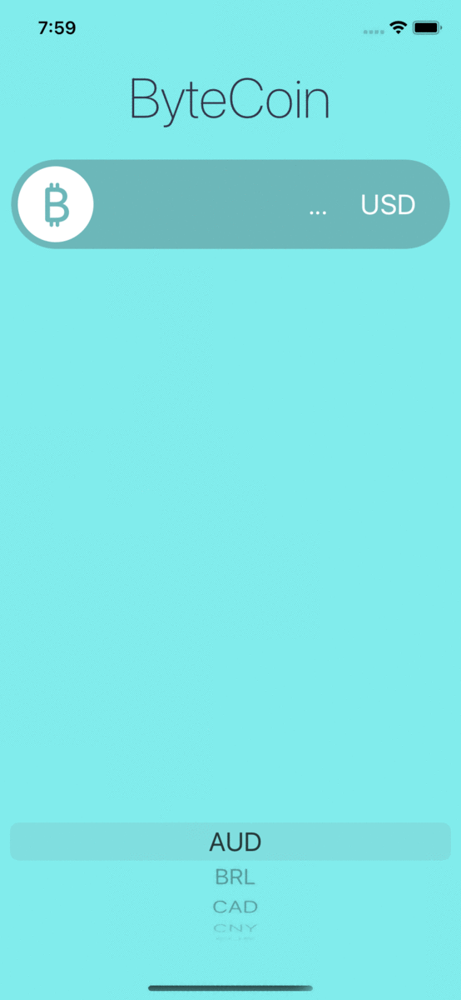

# ByteCoin

## Goal

This is my attempt to get data from coin API and present cost of Bitcoin for end user. 

## Key elements

* Using the Model-View-Controller/MVC pattern for app development
* Using Swift Structures
* Picker Controller

	

